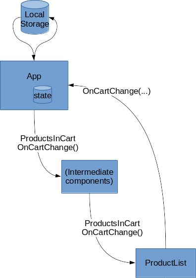
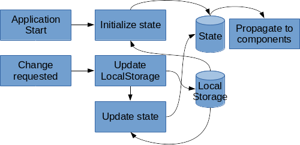

# potato-store-front
A front for the potato store with all goods except potatoes. School project in TDT4242.

GitHub pages link: http://tutturen.github.io/potato-store-front

## Usage

### Installing dependencies

This project uses a JavaScript-stack. You should install Node and yarn before installing the project specific dependencies with:

```sh
yarn install
```

### Configuring

We use [environment variables](https://en.wikipedia.org/wiki/Environment_variable) to hold configurations we expect to differ between installations. The linked Wikipedia article is mandatory reading if you are not already familiar with how to use environment variables. Commands below do _not_ include the process of configuring environment variables.

Environment variable | Description | Default value
---------------------|-------------|--------------
`REACT_APP_BACKEND` | URL of the backend to use. This is likely the only variable you need to set. When you run Django locally, you should set this to something like `http://localhost:8000`. | `https://potato-store.herokuapp.com` (our deployed backend).
`REACT_APP_CSRF_COOKIE` | Name of cookie with the CSRF token for the backend. Must match the `CSRF_COOKIE_NAME` Django setting. | `csrftoken` (the default in Django). 
`REACT_APP_CSRF_HEADER` | Name of header to submit CSRF token in when talking with the backend. Must match the `CSRF_HEADER_NAME` Django setting. | `X-CSRFToken` (the default in Django).


### Building

Used when going into production, with extra optimizations. Warnings are elevated to errors, so take care.

```sh
yarn build
```

### Developing

Start local development server, by default at port 3000. You'll probably want to set the `REACT_APP_BACKEND` environment variable, as described above.

```sh
yarn start
```

### [Storybook](https://storybook.js.org/)

Utility for developing individual React Components, with the ability to use different properties so you can exercise different aspects of your Component.

```sh
yarn run storybook
```

## Technologies

We mention the most important technologies here, to make it easier for readers to understand what's going on.

### [React](https://reactjs.org/)

Too big to describe with own words here, but it lets us create a single page application in a way where you can trace the flow of data easily, and encapsulate the different parts of your page.

### [Immutability](https://facebook.github.io/immutable-js/)

Another aid in making it easier to understand what happens to data. All state property values use this library to become immutable, to ensure we don't change them by accident and to make it easier for React to see what changed.

This library has a little trick to it: You cannot necessarily access properties like you would on native objects. For example, `cart.add` is wrong, but `cart.get('add')` works. If you'd like to use the usual way of accessing the content, you can use methods to convert the immutable object to something more familiar. See the linked documentation.

## Important React components

Component | Description
----------|------------
App | Main part, put inside whatever Router is relevant. Controls much of the state. Split into Layout and Main.
Layout | Responsible for the overall layout. Includes the Header and Content. The children is used as the main content.
Header | Header shared by all pages.
Content | Wrapper with stylings specific to the main content part of the page.
Main | Main part of the page, with all the routes of highest level (deeper components may employ more specific routes).

## Structure

### Data flow, cart



Data flows from top and downwards. The App component is the highest common ancestor, and is therefore where the state is located. Property names do not correspond with the code.

### Reading and writing state



When the application starts, the App component gets its state from LocalStorage for variables that are saved across visits to the site. Other data is just initialized to defaults. Afterwards, whenever a change is required – like adding a product to the cart – a function in the App component is invoked which first updates LocalStorage, then reads state from LocalStorage. We use this approach to reduce the space where bugs can occur, by using the same procedure to get state values both on initialization and on later changes. By using the React state, we can use the native way of propagating and re-rendering the page when changes occur.

